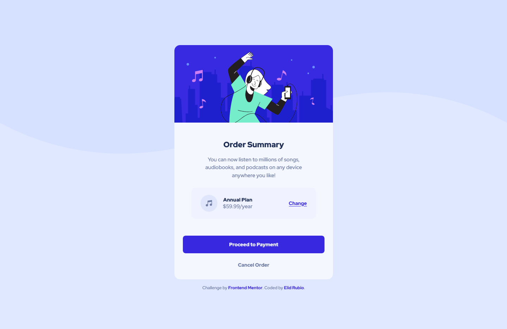

# Frontend Mentor - Frontend Mentor - Order summary card solution

This is a solution to the [Order summary card challenge on Frontend Mentor](https://www.frontendmentor.io/challenges/order-summary-component-QlPmajDUj). Frontend Mentor challenges help you improve your coding skills by building realistic projects. 

## Table of contents

- [Overview](#overview)
  - [The challenge](#the-challenge)
  - [Screenshot](#screenshot)
  - [Links](#links)
- [My process](#my-process)
  - [Built with](#built-with)
  - [Useful resources](#useful-resources)
- [Author](#author)

**Note: Delete this note and update the table of contents based on what sections you keep.**

## Overview

### The challenge

Users should be able to:

- View the optimal layout depending on their device's screen size
- See hover states for interactive elements

### Screenshot

### Links

- Solution URL: [See Solution](https://www.frontendmentor.io/solutions/order-summary-component-AwgULk9Ch4)
- Live Site URL: [See Live Site](https://elidrc.github.io/order-summary-component/)

## My process

### Built with

- HTML
- CSS

### Useful resources

- [Youtube](https://www.youtube.com)
- [w3schools](https://www.w3schools.com)
- [StackOverflow](https://www.stackoverflow.com)

## Author

- Frontend Mentor - [@elidrc](https://www.frontendmentor.io/profile/elidrc)
